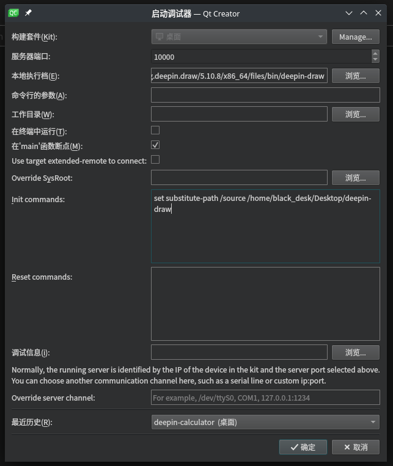

# IDE中调试玲珑应用

_以下操作以`deepin-draw`为例_
由于玲珑应用运行在容器中，想要在宿主机上对其进行调试，我们需要使用 gdbserver，操作如下所示：

```bash
sudo apt install gdbserver gdb -y
```

如果安装了`gdb`和`gdbserver`工具，可以命令行启动玲珑应用和`gdbserver`端，操作如下所示：

```bash
ll-cli run org.deepin.draw --exec /bin/bash
gdbserver  :10240 deepin-draw
```

这里以调试应用`org.deepin.draw`为例。上述命令中，`:10240`为任意当前没有被占用的 tcp 端口。之后我们还需要做两件事情：

1. 在`host`主机中使用`gdb`连接上容器中的`gdbserver`
2. 设置源码映射路径。（按需求来设置）

## 在终端中使用 gdb 进行调试

1. 找到玲珑应用实际上启动的二进制在宿主机上的位置，例如：

   ```text
   /var/lib/linglong/layers/org.deepin.draw/5.10.8/x86_64/files/bin/deepin-draw
   ```

   _其中版本号和架构按照实际情况填写。_

   在`Host`环境中使用`gdb`加载二进制文件，即`deepin-draw`，操作如下所示：

   ```bash
   gdb  /var/lib/linglong/layers/org.deepin.draw/5.10.8/x86_64/files/bin/deepin-draw
   ```

2. 在`gdb`中使用`target`命令连接`gdbserver`，操作如下所示：

   ```bash
   target remote :10240
   ```

3. 在`gdb`中输入以下命令以设置路径映射，帮助`gdb`找到对应的源代码，假定源码放置在`host`主机的`Desktop`，命令如下：

   ```bash
   set substitute-path /buildstream/deepin-draw/deepin-draw.bst ~/Desktop/deepin-draw
   ```

之后正常使用`gdb`即可。

## QtCreator 配置

参考上述过程，我们可以很轻松地完成`QtCreator`的配置：

依次点击：调试>开始调试>连接到正在运行的调试服务器，在对话框中填入：

```text
服务器端口： `10240`  # *任意`10000`以上的任意空闲端口*

本地执行档案：`/var/lib/linglong/layers/org.deepin.draw/5.10.8/x86_64/files/bin/deepin-draw`   # *需要调试的二进制文件*

Init Commands: `set substitute-path /buildstream/deepin-draw/deepin-draw.bst ~/Desktop/deepin-draw` # *设置源码的目录*
```

大致配置如下图所示：



配置完成后，即可正常使用`QtCreator`来进行调试了。

## VSCODE 配置

TODO

## CLION 配置

TODO
